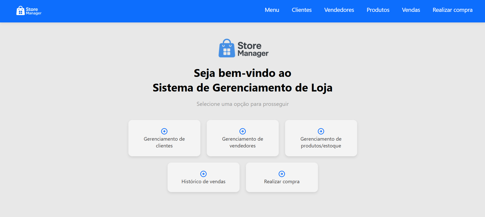
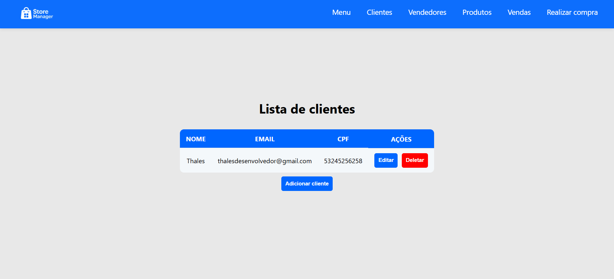
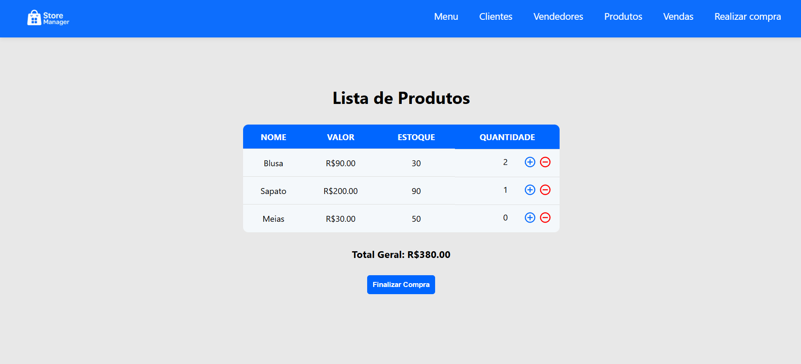
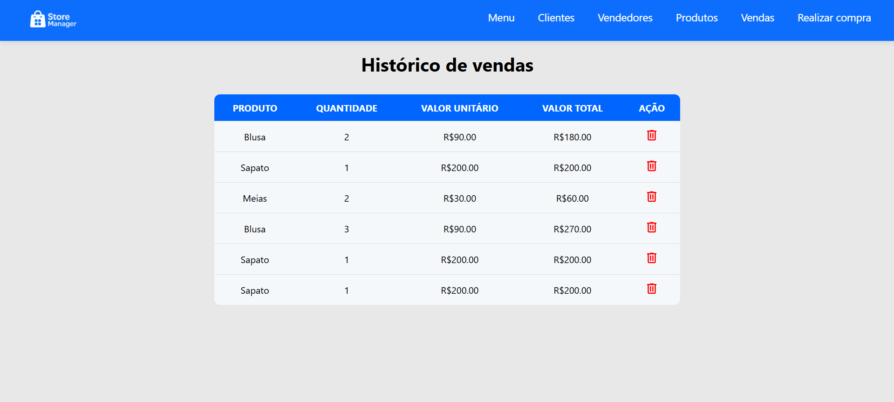

# Sistema de Gerenciamento de Loja

## Sobre o projeto
Uma aplicação web full-stack que permite aos usuários visualizar, criar, editar, atualizar e excluir, clientes, vendedores e produtos, além de poder realizar compras e visualizar o histórico de vendas. Desenvolvido com Angular no frontend e Java com Spring Boot no backend.

## Funcionalidades:
### Operações CRUD:
- **Gerenciamento de clientes**
- **Gerenciamento de vendedores**
- **Gerenciamento de produtos.** *Obs: Um produto associado a uma venda não pode ser excluído. Isso é uma medida de integridade de dados para garantir que os registros de vendas mantenham consistência e histórico completo.*

### Operações de vendas:
- **Registro de compras e vendas:** ao entrar na área de realizar uma compra, o usuário pode escolher um produto cadastrado na plataforma para comprar e a quantidade de cada produto que deseja. A plataforma irá calcular o subtotal de cada produto, e o total geral de sua compra.
- **Atualização de estoque:** Ao efetuar uma compra, a quantidade comprada de cada produto é automaticamente descontada do estoque. O sistema mantém o controle do estoque em tempo real com base nas vendas registradas.

## Tecnologias utilizadas:
### Backend
- Java 17
- Spring Boot
- Spring Data JPA
- Hibernate
- MySQL

### Frontend
- Angular 17
- TypeScript
- HTML
- SCSS

### DevOps
- Docker

## Como executar o projeto:
### Pré-requisitos:
- Docker instalado

### Passos para a execução:
1.**Clone o repositório com esse comando:**
```bash
git clone https://github.com/thalesmanoel/store-management-system
```

2. **Entre no diretório que está o projeto**
```bash
cd /store-management-system
```

4. **Abra o seu terminal e rode o comando do Docker abaixo:**
```bash
docker-compose up --build
```

6. **Abra o navegador e acesse:**
```bash
http://localhost:4200
```

8. **Feito isso você poderá explorar o sistema e suas funcionalidades, começando com o menu inicial**

## Explorando as funcionalidades:


- Na tela de menu você pode escolher inicialmente fazer a criação de um cliente, vendedor ou produto. Ao clicar na opção de "Gerenciamento de clientes", você será redirecionado para essa tela:



- Ao entrar nessa opção você pode selecionar o botão "Adicionar cliente", para criar um cliente, e assim você será redirecionado para a tela de cadastro, e poderá também, editar ou excluir depois de criado, através dos ícones na coluna de ações.

- Essa estrutura de CRUD é a mesma para Clientes, Vendedores e Produtos.

- É possível também realizar compras a partir de produtos cadastrados na plataforma. Você pode colocar a quantidade que você quer de cada item, e com isso, será calculado o total da sua compra. Em seguida é descontado o estoque dos produtos nos quais você comprou.



- Agora você pode voltar ao menu inicial e selecionar a opção de "Histórico de vendas", nessa tela você poderá vizualizar os produtos comprados, as quantidades de cada produto e o total de cada compra.



## Endpoints:
- Para testar as enpoints, é possível acessando com o caminho abaixo, completando com cada requisição HTTP:
```bash
http://localhost:8080
```
### Cliente
- **GET:**   /api/client/get
- **GET:**   /api/client/get/{id}
- **POST:**  /api/client/post
- **PUT:**   /api/client/update/{id}
- **DELETE** /api/client/delete/{id}
  
### Vendedor
- **GET:**   /api/seller/get
- **GET:**   /api/seller/get/{id}
- **POST:**  /api/seller/post
- **PUT:**   /api/seller/update/{id}
- **DELETE** /api/seller/delete/{id}

### Produto
- **GET:**   /api/product/get
- **GET:**   /api/product/get/{id}
- **POST:**  /api/product/post
- **PUT:**   /api/product/update/{id}
- **DELETE** /api/product/delete/{id}

## Contatos
- E-mail: thalesdesenvolvedor@gmail.com
- Acesse meu [Linkedin](https://www.linkedin.com/in/thales-carrion/)
- WhatsApp: (15)992717403


  


